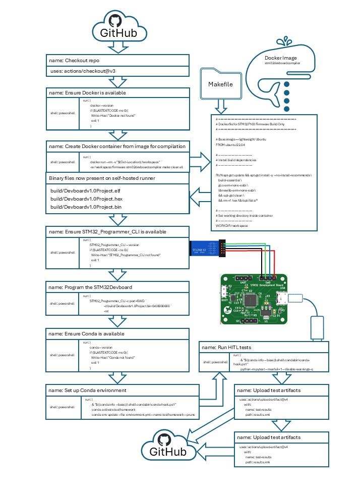
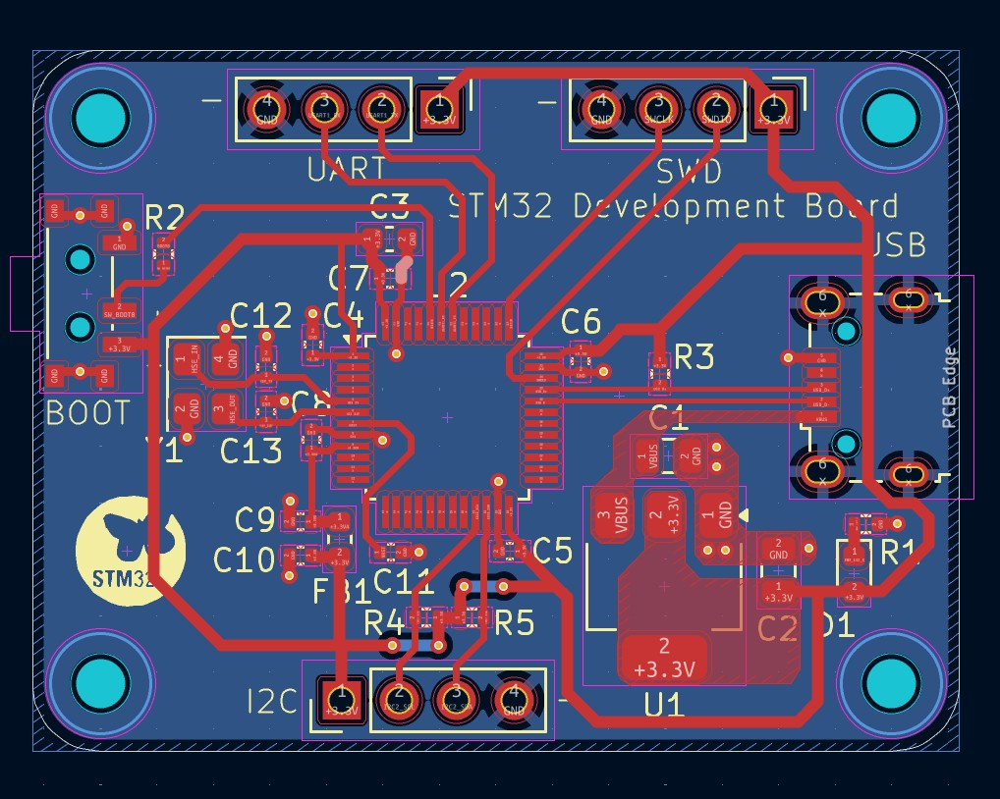
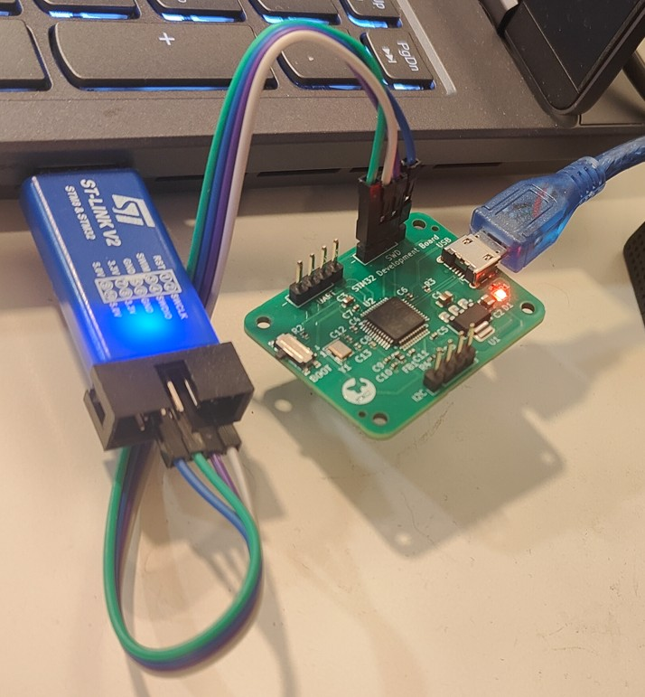

# STM32Devboard – Firmware + HITL Simulation in CI





*A combined hardware + firmware + automated test demonstration project*

This project demonstrates a **Hardware-In-The-Loop (HITL)-style automated test pipeline** using a **custom STM32F103C8T6 development board that I designed in KiCad**, combined with firmware validation using **Pytest** and **GitHub Actions**.

When code is pushed or a pull request is opened, the CI workflow automatically:

1. **Builds the firmware**
2. **Flashes the STM32F103C8T6 board** connected to the GitHub Actions runner
3. **Runs Pytest-based functional tests** against the physical device
4. **Reports pass/fail status** back to GitHub

This pipeline simulates a professional HITL test system, showing how real hardware can be validated automatically using continuous integration.

---

## 📦 Project Structure

```
Test_Serial/
│
├── firmware/              # Embedded C firmware for STM32F103C8T6
│   ├── src/
│   ├── include/
│   └── (build artifacts ignored via .gitignore)
│
├── tests/                 # Pytest functional tests for HITL validation
│   ├── test_commands.py
│   ├── test_math_ops.py
│   ├── dut_config.json    # PID/VID → auto-detect COM port
│   └── helpers/
│
├── hardware/              # Full KiCad project for the custom STM32 board
│   ├── *.kicad_pro
│   ├── *.kicad_sch
│   ├── *.kicad_pcb
│   ├── symbols/
│   └── footprints/
│
├── scripts/               # Optional Python helper scripts
│
├── requirements.txt       # Python dependencies for Pytest HITL tests
├── .gitignore
└── README.md
```

The KiCad project is intentionally included to showcase the board design to recruiters/employers.
Only temporary, generated, and fabrication files are ignored via `.gitignore`.

---

## 🔧 Hardware Overview (Custom STM32F103C8T6 Board)

The DUT is a custom development board designed in **KiCad**. The design includes:

* STM32F103C8T6 microcontroller
* USB-to-UART for firmware testing
* SWD debug header
* Power regulation and filtering
* Breakouts for serial, GPIO, and test pins

The PCB and schematic files are included so reviewers can inspect routing, component selection, layout style, and design organization.

This hardware is used directly in the HITL CI workflow.

---

## 🧩 Firmware Overview

The embedded firmware is intentionally minimal and built for testing.
It implements a UART command interface supporting:

* A **command/response** handshake
* Four arithmetic operations:

  * **Add**
  * **Subtract**
  * **Multiply**
  * **Divide**
* A small set of additional commands used by the test suite

This makes the board ideal for CI-driven firmware verification.

---

📦 Dependencies
🛠 Development Dependencies
These are tools used during development and design, not required on the CI runner itself:
- STM32CubeMX → generates firmware scaffolding, peripheral initialization code, and startup files for the STM32F103C8T6
- KiCad → full PCB and schematic design for the custom STM32 development board

---

🖥️ Runner Dependencies
These must be installed and available on the self‑hosted runner before the HITL workflow can execute:
- Docker → builds STM32 firmware inside a reproducible container
- STM32CubeProgrammer CLI (CubeProgrammerCLI) → flashes firmware to the STM32 board via SWD
- Python 3.x → interpreter for running HITL test suites
- Conda → environment manager for reproducible Python dependencies
- Git → required by actions/checkout to pull the repository
✅ Verification Checklist
Run these commands on the runner to confirm installation:
docker --version
CubeProgrammerCLI --version
python --version
conda --version
git --version

All commands should return valid version information. If any fail, install or update the missing dependency before running the workflow

---

🐍 Python Dependencies (via Conda)
The Python environment is defined in environment.yml and updated in CI with:
conda env update --file environment.yml --name testframework --prune


Key libraries include:
- pytest → functional test framework for HITL validation
- pyserial → serial communication with the STM32 board
- utility modules → logging, JSON parsing, device enumeration, and test orchestration

---

## 🧪 HITL Test Flow (Pytest)

After flashing the firmware, GitHub Actions triggers **Pytest** to validate real hardware behavior:

* A Python script scans the system’s USB devices
* It loads the `dut_config.json` file to locate the board based on:

  * **PID**
  * **VID**
  * **Baudrate**
* The test suite opens the serial port and sends each supported command
* Responses are parsed and validated

Example Pytest coverage:

* Handshake / ping test
* Add / subtract / multiply / divide
* Error format tests
* Command framing validation

Test artifacts (logs, HTML output, temp files) are fully ignored via `.gitignore`.

---

## 🐳 Dockerized Firmware Build

A Docker container is provided for **reproducible STM32F103 firmware builds**. It includes the ARM toolchain and necessary libraries.

### Usage

Build the Docker image once:

```bash
docker build -t stm32devboardcompiler .
```

Compile firmware from your local source by mounting the repo:

```bash
docker run --rm -v ${PWD}:/workspace -w /workspace/firmware stm32devboardcompiler make all
```

To clean and rebuild:

```bash
docker run --rm -v ${PWD}:/workspace -w /workspace/firmware stm32devboardcompiler make clean all
```

**Notes:**

* The container is purely for building firmware; Python HITL tests run on the host to access the physical board.
* Source code and Makefile remain on the host, so edits are immediately reflected in builds.

---

## ⚙️ GitHub Actions CI

Our CI/CD pipeline is defined in `.github/workflows/*.yml` files using GitHub Actions syntax.  
Each workflow specifies **triggers** under the `on:` key and **jobs** under the `jobs:` key.

### 🔔 Triggers
The workflow runs automatically on:
- **Push** → any branch pushed to the remote repo
- **Pull request** → PRs targeting `main`
- **workflow_dispatch** → manual trigger from the Actions tab

### 🛠 Workflow steps
The hitl-test job runs on a self‑hosted runner (with STM32 hardware attached) and performs:
- Checkout repo – pulls the latest code
- Ensure Docker – verifies Docker is installed
- Build firmware – compiles with Dockerized ARM toolchain (make clean all)
- Check CubeProgrammerCLI – verifies ST’s programmer tool is available on the runner
- Flash firmware – programs the STM32F103C8T6 via CubeProgrammerCLI
- Verify Python & Conda – ensures Python and Conda are available
- Update Conda environment – applies environment.yml to the testframework environment (with pruning)
- Run HITL tests – activates the Conda environment and executes pytest against the physical device
🔄 Feedback loop
This setup provides a fully automated feedback loop:
- Firmware is built and flashed
- Hardware‑in‑the‑loop tests validate behavior
- Results are collected and surfaced directly in GitHub


### 🔄 Feedback loop
This setup provides a **fully automated feedback loop**:
- Firmware is built and flashed
- Hardware‑in‑the‑loop tests validate behavior
- Results are collected and surfaced directly in GitHub

---

## 🐍 Python Environment

🐍 Python Environment
This CI workflow uses Conda to manage dependencies reproducibly.

Update the environment locally with:
conda env update --file environment.yml --name testframework --prune


Activate the environment:
conda activate testframework


Run tests:
python -m pytest --maxfail=1 --disable-warnings -q


Key libraries include:
- pytest
- pyserial
- Utility modules for device enumeration and communications


---

## 🔌 DUT Configuration File (`dut_config.json`)

This file determines which device to test against:

```json
{
    "pid": "0x1234",
    "vid": "0x5678",
    "baudrate": 115200
}
```


Pytest uses these identifiers to automatically determine the correct COM port.

This avoids any hard-coding and ensures the CI system always targets the correct board.

---

## 📝 License

This project is licensed under the **MIT General Public License (GPL)**.
See the `LICENSE` file for details.

---

## 🛠️ Future Improvements

* SQL logging of test metrics
* More extensive command set
* Automated hardware reset between test cycles
* Multi-device testing support
* Hardware fault injection
* Coverage reporting and test data visualization
* Linting and SCA of Embedded Code
* Add I2C and UART communcation
* Add automated testing with logic analyzer
* ccache in Docker for faster builds
